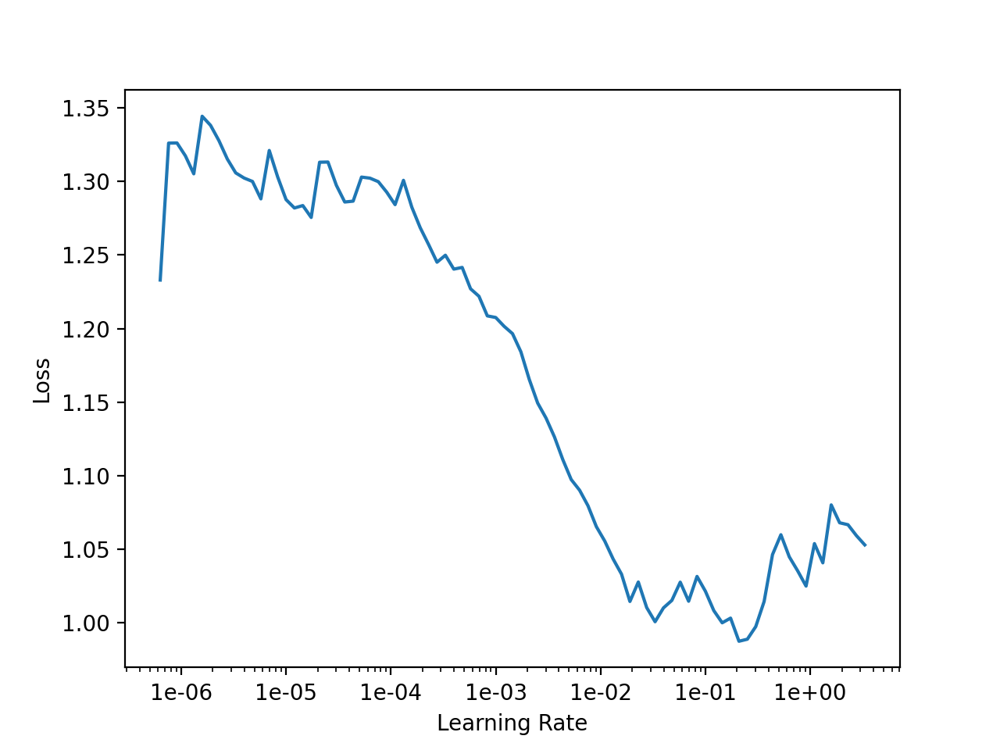
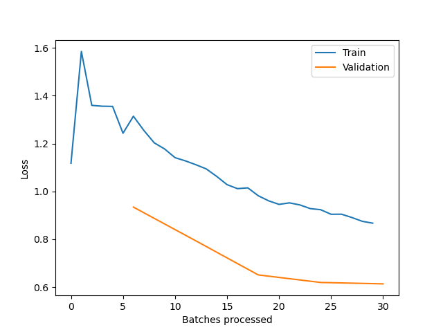

# Spine Dataset
This is a simple Binary Classification Problem. [Dataset source](https://www.kaggle.com/sammy123/lower-back-pain-symptoms-dataset). Architecture is nothing novel either, it is a simple FNN with no regularization layers.

My first attempt with [fastai](https://docs.fast.ai/) training loop, absolutely loved the simplicity. I absolutely loved using fastai:
1. Visualisations are really awesome
2. Very less boiler plate code needed. 

All I have to edit now, is just change the model architecture [here](./model.py). I can concentrate only on the algorithm and leave other things to this process. Which frees up space and can help very much in fast prototyping ideology, to which I'm a fan.

## Setting Up
Conda Install (Recommended Way)
```
conda create --name fastai
conda activate fastai
conda install -c pytorch -c fastai fastai
```

Pip Install
```
pip install fastai
```
If you run into any problem, refer [this](https://pypi.org/project/fastai/)

## Running
```
python run.py
```
During the process, a visualization of the LR v Loss is presented. Then prompted to select learning rate and number of epochs based on that.

## Resources
[This](https://stackoverflow.com/questions/61172627/choosing-the-learning-rate-using-fastais-learn-lr-find) is a good discussion on selecting the optimal learning rate based on the visualization.

## My Results
The Learning Rate Finder gave me this



I have chosen, the learning rate=1e-3 (refer to #resources to understand why?) and the number of epochs to be 5 (just a number, didn't think much).

The training history is



Trained model weights are saved [here](./models/model.pth), if you want to reproduce the results.
